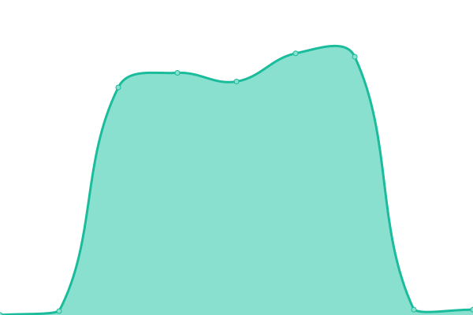
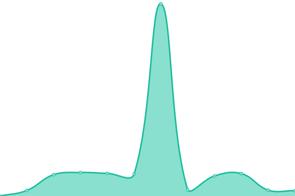
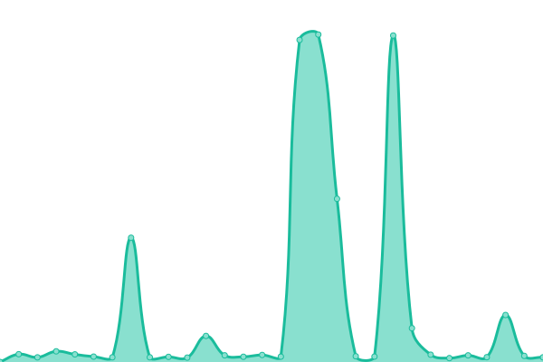
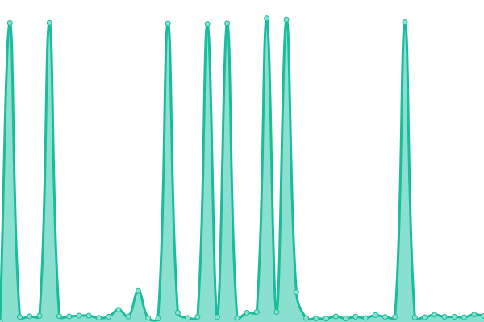

# [📈 Live Status](https://status.safone.dev): <!--live status--> **🟧 Partial outage**

This repository contains the open-source uptime monitor and status page for [AsmSafone](https://safone.dev/), powered by [Upptime](https://github.com/upptime/upptime).

With [Upptime](https://upptime.js.org), you can get your own unlimited and free uptime monitor and status page, powered entirely by a GitHub repository. We use [Issues](https://github.com/AsmSafone/uptime/issues) as incident reports, [Actions](https://github.com/AsmSafone/uptime/actions) as uptime monitors, and [Pages](https://status.safone.dev) for the status page.

<!--start: status pages-->
<!-- This summary is generated by Upptime (https://github.com/upptime/upptime) -->
<!-- Do not edit this manually, your changes will be overwritten -->
<!-- prettier-ignore -->
| URL | Status | History | Response Time | Uptime |
| --- | ------ | ------- | ------------- | ------ |
|  [Safone API](https://api.safone.dev) | 🟥 Down | [safone-api.yml](https://github.com/AsmSafone/uptime/commits/HEAD/history/safone-api.yml) | 

 0ms
     
 | 

<a href="https://status.safone.dev/history/safone-api">0.00%</a>
    

|  [Github API](https://gh-api.glitch.me) | 🟩 Up | [github-api.yml](https://github.com/AsmSafone/uptime/commits/HEAD/history/github-api.yml) | 

 14120ms
     
 | 

<a href="https://status.safone.dev/history/github-api">100.00%</a>
    

|  [24/7 Radio](https://rtmp.fly.dev/start) | 🟩 Up | [24-7-radio.yml](https://github.com/AsmSafone/uptime/commits/HEAD/history/24-7-radio.yml) | 

 3044ms
     
 | 

<a href="https://status.safone.dev/history/24-7-radio">99.44%</a>
    

|  [My Meet](https://my-meet.onrender.com) | 🟩 Up | [my-meet.yml](https://github.com/AsmSafone/uptime/commits/HEAD/history/my-meet.yml) | 

 3557ms
     
 | 

<a href="https://status.safone.dev/history/my-meet">95.92%</a>
    

|  [Auth Bot](https://auth-w1dd.onrender.com) | 🟥 Down | [auth-bot.yml](https://github.com/AsmSafone/uptime/commits/HEAD/history/auth-bot.yml) | 

 2263ms
     
 | 

<a href="https://status.safone.dev/history/auth-bot">94.77%</a>
    

|  [Forward Bot](https://aforward.onrender.com) | 🟩 Up | [forward-bot.yml](https://github.com/AsmSafone/uptime/commits/HEAD/history/forward-bot.yml) | 

 180ms
     
 | 

<a href="https://status.safone.dev/history/forward-bot">100.00%</a>
    

<!--end: status pages-->

[**Visit our status website →**](https://status.safone.dev)

## 📄 License

- Powered by: [Upptime](https://github.com/upptime/upptime)
- Code: [MIT](./LICENSE) © [Anand Chowdhary](https://anandchowdhary.com), supported by [Pabio](https://pabio.com)
- Data in the `./history` directory: [Open Database License](https://opendatacommons.org/licenses/odbl/1-0/)
